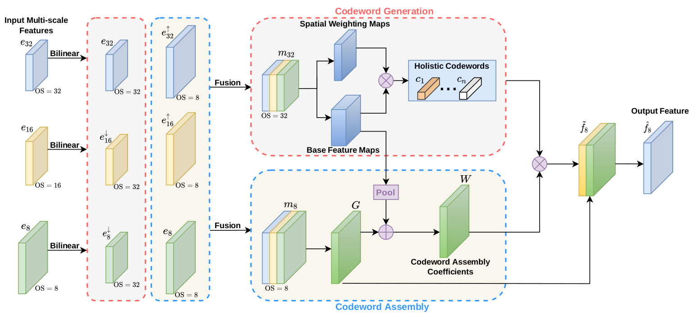

# [EfficientFCN: Holistically-Guided Decoding for Semantic Segmentation (ECCV20)]



## Introduction
We propose a holistically-guided decoder (HGD) for achieving discriminative deep feature
representations. With the proposed HGD, our EfficientFCN method for semantic segmentation 
achieves comparable or even better performance than state-of-the-art methods with only 
1/3 of their computational costs on PASCAL Context, PASCAL VOC and ADE20K datasets.

Recently, we integrate the proposed HGD into the original FPN architecture to implement one
novel FPN-variant [HGD-FPN](https://github.com/jianbo909/HGD_FPN) for object detection.

## Usage

1. Install pytorch
  
   -The code is tested on python3.6 and torch>1.1.0
   
   -The code is modified from [PyTorch-Encoding](https://github.com/zhanghang1989/PyTorch-Encoding).

2. Clone the resposity

   ```shell
   git clone https://github.com/jianbo909/efficientFCN.git
   cd efficientFCN
   python setup.py install
   ``` 
3. Dataset
   
   -Prepare the datasets by runing the scripts in the scripts folder, for example preparing PASCAL Context dataset:

   ```shell
   python scripts/prepare_pcontext.py
   ``` 

4. Training

   -The training scripts for pcontext and ADE20K are in the experiments/segmentation/scripts_train/ folder. For example, the training command for pcontext dataset:

   ```shell
   ./scripts_train/train_efficientFCN_pcontext.sh
   ``` 

5. Evaluation
   
   -The testing scripts are in the experiments/segmentation/test_scripts folder. For example, the training command for pcontext dataset:

   ```shell
   ./test_scripts/train_efficientFCN_resnet101_pcontext_MS.sh /path/to/model
   ``` 


## Citation

```
@inproceedings{liu2020efficientfcn,
  title={EfficientFCN: Holistically-guided Decoding for Semantic Segmentation},
  author={Liu, Jianbo and He, Junjun and Zhang, Jiawei and Ren, Jimmy S and Li, Hongsheng},
  booktitle={European Conference on Computer Vision},
  pages={1--17},
  year={2020},
  organization={Springer}
}
```

## Acknowledgement
Thanks [PyTorch-Encoding](https://github.com/zhanghang1989/PyTorch-Encoding)!
